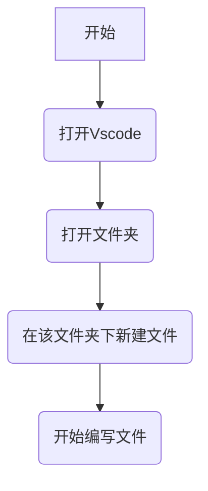

# Markdown 使用教程

<!-- 这是一个单行注释，不会被显示 -->

## 1 Markdown 的使用途径
Markdown 可以直接在 Vscode (Virtual Studio code) 里使用，流程为：


## 2 Markdown 的基本用法
### 2.1 显示标题
首先就是标题的显示，如下述代码。
```markdown
<!-- markdown -->
# 一级标题
## 二级标题
### 三级标题
#### 四级标题
...
```
***渲染结果：***
> <!-- markdown -->
> # 一级标题
> ## 二级标题
> ### 三级标题
> #### 四级标题
> ...
 
### 2.2 段落与换行
直接敲回车换行似乎就行了。
 ```markdown
 这里是第一行。
 这里是第二行。
 ```
***渲染结果：***
> 这里是第一行
> 这里是第二行

### 2.3 粗体\斜体
有粗体、斜体以及粗斜体。
```markdown
*斜体*
**粗体**
***粗斜体***
```
***渲染结果：***
> *斜体*
> **粗体**
> ***粗斜体***

### 2.4 条目
#### 2.4.1 有序列表
```markdown
1. 第一项
2. 第二项
3. 第三项
```
***渲染效果：***
> 1. 第一项
> 2. 第二项
> 3. 第三项

#### 2.4.2 无序列表
```markdown
- 项目一
- 项目二
  - 子项目（前面加两个空格或一个Tab）
- 项目三
```
***渲染效果：***
> - 项目一
> - 项目二
>   - 子项目（前面加两个空格或一个Tab）
> - 项目三

#### 2.4.3 任务列表
```markdown
- [ ] 未完成
- [x] 已完成
```
***渲染效果：***
> - [ ] 未完成
> - [x] 已完成
扩展，采用Tab键
```markdown
- [ ] 完成信号滤波算法项目
  - [x] 文献调研
  - [ ] 公式推导
    - [ ] 推导传递函数
    - [ ] 证明收敛性
  - [ ] 代码实现
  - [ ] 撰写实验报告
- [ ] 整理线性代数笔记
```
***渲染效果：***
> - [ ] 完成信号滤波算法项目
>   - [x] 文献调研
>   - [ ] 公式推导
>     - [ ] 推导传递函数
>     - [ ] 证明收敛性
>   - [ ] 代码实现
>   - [ ] 撰写实验报告
> - [ ] 整理线性代数笔记
### 2.5 代码
#### 2.5.1 行内代码
```markdown
我们可以使用 `printf()` 函数来打印输出。
```
***渲染效果：***
> 我们可以使用 `printf()` 函数来打印输出。

#### 2.5.2 代码块
代码块采用如下的方式
```markdown
  ```language
  <code>
  ```
```
下面显示markdown代码和运行结果
```markdown
  ```python
  # 这是一个Python代码块
  def hello():
      print("Hello, World!")
  ```
```

```markdown
  ```matlab
  % 这是一个MATLAB代码块
  A = [1, 2, 3];
  plot(A);
  ```
```
***渲染效果：***
> ```python
> # 这是一个Python代码块
> def hello():
>     print("Hello, World!")
> ```

> ```matlab
> % 这是一个MATLAB代码块
> A = [1, 2, 3];
> plot(A);
> ```

## 3 数学环境

### 3.1 行内公式
Markdown 原生支持 $\LaTeX$ 公式语法
```markdown
公式为：$E=mc^2$
```
***渲染效果：***
> 公式为：$E=mc^2$

### 3.2 块公式
独立成行： 用 `$$ ... $$`包裹。
```markdown
公式为：$$E=mc^2$$
```
***渲染效果：***
> 公式为：$$E=mc^2$$

## 4 流程和图表

### 4.1 流程图
使用**代码块**功能，但将语言声明为 `mermaid`。

```markdown
  ```mermaid
  graph TD 
  A[1]-->B[2]
  ```
```
***渲染效果：***
> ```mermaid
> graph TD 
> A[1]-->B[2]
> ```

### 4.2 表格
表格代码如下：
```markdown
| 左对齐 | 居中对齐 | 右对齐 |
| :--- | :---: | ---: |
| 单元格内容 | 单元格内容 | 单元格内容 |
| 第二行 | 第二行 | 第二行 |
```
***渲染效果：***
> | 左对齐 | 居中对齐 | 右对齐 |
> | :--- | :---: | ---: |
> | 单元格内容 | 单元格内容 | 单元格内容 |
> | 第二行 | 第二行 | 第二行 |